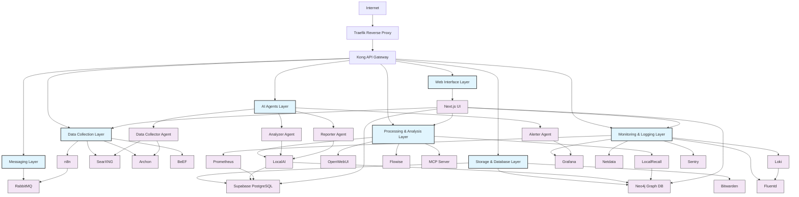

# OSINT Platform Architecture Diagram

```mermaid
graph TD
    A[Internet] --> B[Traefik Reverse Proxy]
    B --> C[Kong API Gateway]
    
    C --> D[Data Collection Layer]
    C --> E[Processing & Analysis Layer]
    C --> F[Storage & Database Layer]
    C --> G[Monitoring & Logging Layer]
    C --> H[Messaging Layer]
    C --> I[AI Agents Layer]
    C --> J[Web Interface Layer]
    
    %% Data Collection Layer
    D --> D1[SearXNG]
    D --> D2[Archon]
    D --> D3[BeEF]
    D --> D4[n8n]
    
    %% Processing & Analysis Layer
    E --> E1[LocalAI]
    E --> E2[OpenWebUI]
    E --> E3[LocalRecall]
    E --> E4[Flowise]
    E --> E5[MCP Server]
    
    %% Storage & Database Layer
    F --> F1[Supabase PostgreSQL]
    F --> F2[Neo4j Graph DB]
    F --> F3[Bitwarden]
    
    %% Monitoring & Logging Layer
    G --> G1[Prometheus]
    G --> G2[Grafana]
    G --> G3[Netdata]
    G --> G4[Loki]
    G --> G5[Fluentd]
    G --> G6[Sentry]
    
    %% Messaging Layer
    H --> H1[RabbitMQ]
    
    %% AI Agents Layer
    I --> I1[Data Collector Agent]
    I --> I2[Analyzer Agent]
    I --> I3[Reporter Agent]
    I --> I4[Alerter Agent]
    
    %% Web Interface Layer
    J --> J1[Next.js UI]
    
    %% Internal Connections
    D4 --> H1
    E1 --> F1
    E1 --> F2
    E3 --> F2
    G1 --> F1
    G4 --> G5
    I1 --> D1
    I1 --> D2
    I2 --> E1
    I3 --> E1
    I4 --> G2
    J1 --> F1
    J1 --> F2
    J1 --> D
    J1 --> E
    J1 --> G
    
    classDef layer fill:#e1f5fe,stroke:#333,stroke-width:2px;
    classDef service fill:#f3e5f5,stroke:#333,stroke-width:1px;
    
    class D,E,F,G,H,I,J layer;
    class D1,D2,D3,D4,E1,E2,E3,E4,E5,F1,F2,F3,G1,G2,G3,G4,G5,G6,H1,I1,I2,I3,I4,J1 service;
```